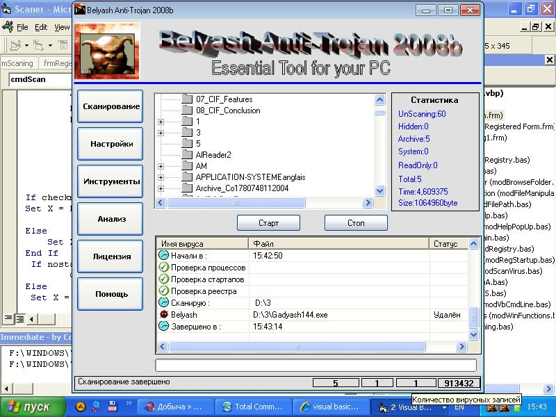



## Belyash AntiVirus 2008

### Description

Find and delete virus,trojan,worm,spy etc.

Old version on vb 6.0
 
### More Info
 
not

Vb 6.0 ;)

             |
---                |---
**Submitted On**   |2009-07-01 08:11:42
**By**             |[mrbelyash](https://github.com/Planet-Source-Code/PSCIndex/blob/master/ByAuthor/mrbelyash.md)
**Level**          |Intermediate
**User Rating**    |3.7 (11 globes from 3 users)
**Compatibility**  |VB 6\.0
**Category**       |[Files/ File Controls/ Input/ Output](https://github.com/Planet-Source-Code/PSCIndex/blob/master/ByCategory/files-file-controls-input-output__1-3.md)
**World**          |[Visual Basic](https://github.com/Planet-Source-Code/PSCIndex/blob/master/ByWorld/visual-basic.md)
**Archive File**   |[Belyash\_An2161338302009\.zip](https://github.com/Planet-Source-Code/mrbelyash-belyash-antivirus-2008__1-72415/archive/master.zip)

### API Declarations

yes

